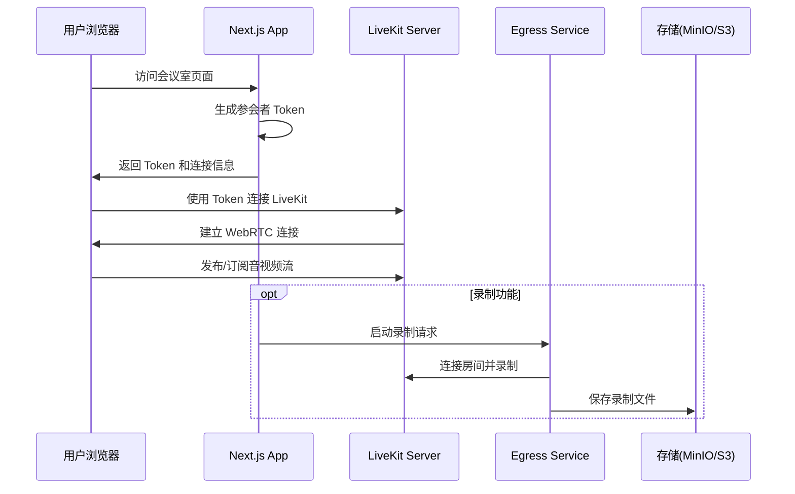

# WARP.md

这个文件为 WARP (warp.dev) 在此代码库中工作时提供指导。

## 项目简介

这是一个基于 LiveKit 的视频会议应用 Demo，结合了：
- **Next.js 15** - React 框架和 App Router
- **LiveKit Client SDK** - 实时音视频通信
- **LiveKit Server SDK** - Token 签发和录制功能
- **LiveKit Components** - 预构建的 UI 组件
- **Docker** - 容器化部署，包含完整的 LiveKit 生态服务

## 项目架构

### 核心目录结构

```
livekit-meet-demo/
├── meet/                          # Next.js 应用主目录
│   ├── app/                       # App Router 路由
│   │   ├── api/                   # API 路由
│   │   │   ├── connection-details/ # Token 签发接口
│   │   │   └── record/             # 录制相关接口
│   │   ├── rooms/[roomName]/       # 动态房间路由
│   │   ├── recorder/               # 录制器页面
│   │   ├── custom/                 # 自定义连接页面
│   │   ├── layout.tsx              # 全局布局
│   │   └── page.tsx                # 首页
│   ├── lib/                       # 工具库
│   │   ├── client-utils.ts         # 客户端工具函数
│   │   ├── types.ts                # TypeScript 类型定义
│   │   └── SettingsMenu.tsx        # 设置菜单组件
│   ├── styles/                    # 样式文件
│   └── package.json               # 依赖配置
├── livekit-config/                # LiveKit 服务配置
│   ├── livekit.yaml               # LiveKit Server 配置
│   └── egress-config.yaml         # Egress 录制服务配置
├── docker-compose.yml             # Docker 编排文件
├── start-livekit.sh               # 智能启动脚本
└── recordings/                    # 录制文件存储目录
```

### 数据流架构



### 关键组件说明

- **Token 签发**: `app/api/connection-details/route.ts` 使用 LiveKit Server SDK 生成访问令牌
- **房间组件**: 使用 `@livekit/components-react` 提供的预构建组件
- **录制功能**: 通过 LiveKit Egress 服务实现合成录制
- **存储**: 使用 MinIO 作为 S3 兼容的对象存储

## 快速开始

### 环境要求

- Node.js >= 18
- pnpm (推荐) 或 npm
- Docker 和 Docker Compose

### 本地开发

1. **进入 meet 目录并安装依赖**:
```bash
cd meet
pnpm install
```

2. **配置环境变量**:
```bash
cp .env.example .env.local
```

编辑 `.env.local` 文件：
```bash
# 使用本地 LiveKit Server
LIVEKIT_API_KEY=devkey
LIVEKIT_API_SECRET=secret
LIVEKIT_URL=ws://127.0.0.1:7880
NEXT_PUBLIC_LIVEKIT_URL=ws://127.0.0.1:7880
```

3. **启动 LiveKit 服务**:
```bash
# 在项目根目录
docker-compose up -d livekit-server redis
```

4. **启动开发服务器**:
```bash
cd meet
pnpm dev
```

5. **访问应用**: http://localhost:3000

### Docker 完整部署

```bash
# 在项目根目录
docker-compose up -d --build
```

这将启动：
- LiveKit Server (端口 7880)
- Next.js 应用 (端口 3000，通过 meet/Dockerfile 构建)
- Redis (内部通信)
- Egress 录制服务 (端口 8080)
- MinIO 对象存储 (端口 9000)

## 常用命令

### 开发命令

```bash
# 在 meet/ 目录下执行
pnpm dev              # 启动开发服务器
pnpm build            # 构建生产版本
pnpm start            # 启动生产服务器
pnpm lint             # 代码检查
pnpm lint:fix         # 自动修复代码问题
pnpm format:check     # 检查代码格式
pnpm format:write     # 格式化代码
pnpm test             # 运行测试
```

### Docker 命令

```bash
# 启动所有服务
docker-compose up -d --build

# 查看服务状态
docker-compose ps

# 查看日志
docker-compose logs -f [service-name]

# 停止服务
docker-compose down

# 重启服务
docker-compose restart [service-name]
```

### LiveKit 相关命令

```bash
# 仅启动开发环境的 LiveKit 服务
./start-dev.sh

# 智能启动脚本（自动检测 IP）
./start-livekit.sh

# 启动包含录制功能的完整环境
./start-with-recording.sh
```

## 环境变量配置

### 必需变量

```bash
# LiveKit 服务器配置
LIVEKIT_API_KEY=devkey                    # API 密钥
LIVEKIT_API_SECRET=secret                 # API 秘钥
LIVEKIT_URL=ws://localhost:7880           # 服务端连接地址
NEXT_PUBLIC_LIVEKIT_URL=ws://localhost:7880 # 客户端连接地址

# 录制功能配置 (可选)
S3_ENDPOINT=http://localhost:9000         # MinIO 端点
S3_KEY_ID=minioadmin                      # MinIO 访问密钥
S3_KEY_SECRET=minioadmin                  # MinIO 秘钥
S3_BUCKET=livekit-recordings              # 存储桶
S3_REGION=us-east-1                       # 区域
```

### 容器化部署变量

在容器环境中，需要调整网络地址：

```bash
# Docker 内部服务通信
LIVEKIT_URL=ws://livekit-server:7880
# 浏览器访问（替换为实际服务器 IP）
NEXT_PUBLIC_LIVEKIT_URL=ws://192.168.1.100:7880
```

## 开发指南

### 代码结构约定

- **页面路由**: 使用 Next.js App Router，放置在 `app/` 目录
- **API 接口**: 服务端接口放置在 `app/api/` 目录  
- **共享组件**: 可复用组件放置在 `lib/` 目录
- **类型定义**: TypeScript 类型统一在 `lib/types.ts` 中维护

### Token 签发规范

Token 在 `app/api/connection-details/route.ts` 中签发：

```typescript
const grant: VideoGrant = {
  room: roomName,           // 限制房间访问范围
  roomJoin: true,           // 允许加入房间
  canPublish: true,         // 允许发布媒体
  canPublishData: true,     // 允许发布数据
  canSubscribe: true,       // 允许订阅媒体
};
```

### 环境变量安全

- 服务端私钥（如 `LIVEKIT_API_SECRET`）仅在服务端使用
- 仅将安全的只读地址通过 `NEXT_PUBLIC_` 前缀暴露给客户端

### 代码质量

项目配置了：
- **ESLint** - 代码检查
- **Prettier** - 代码格式化
- **TypeScript** - 类型检查

提交前建议运行：
```bash
pnpm lint && pnpm format:check
```

## 录制功能

### 启动录制

录制功能通过 API 接口触发：

```bash
# 开始录制
curl "http://localhost:3000/api/record/start?roomName=test-room"

# 停止录制
curl "http://localhost:3000/api/record/stop?roomName=test-room"
```

### 录制配置

录制服务配置在 `livekit-config/egress-config.yaml` 中，支持：
- **本地存储**: 文件保存到 `./recordings/` 目录
- **对象存储**: MinIO S3 兼容存储
- **云存储**: AWS S3、Azure、GCP 等

### 录制文件访问

- **MinIO 控制台**: http://localhost:9001 (minioadmin/minioadmin)
- **本地文件**: `./recordings/` 目录

## 故障排查

### 常见问题

**1. 无法连接 LiveKit 服务器**
- 检查 `NEXT_PUBLIC_LIVEKIT_URL` 协议（ws:// 或 wss://）
- 确认端口 7880、7881、50000-50100 未被占用
- 在 Docker 环境中使用 `host.docker.internal` 访问宿主机服务

**2. Token 验证失败**
- 确认 `LIVEKIT_API_KEY` 和 `LIVEKIT_API_SECRET` 与服务器配置一致
- 检查系统时间，时间偏差过大会导致签名失效

**3. 录制功能异常**
- 检查 Egress 服务状态：`docker-compose logs egress`
- 确认存储配置和权限正确
- 验证录制目标存储空间足够

**4. Docker 网络问题**
- 容器间通信使用服务名（如 `livekit-server:7880`）
- 浏览器访问使用宿主机 IP 或域名

### 日志查看

```bash
# 查看所有服务日志
docker-compose logs -f

# 查看特定服务日志
docker-compose logs -f livekit-server
docker-compose logs -f livekit-egress

# 查看 Next.js 应用日志（如果容器化）
docker-compose logs -f meet-app
```

### 服务健康检查

```bash
# LiveKit Server 健康检查
curl http://localhost:7880

# Egress 服务健康检查  
curl http://localhost:8080

# MinIO 健康检查
curl http://localhost:9000/minio/health/live
```

## 测试房间

创建测试房间进行功能验证：

1. 访问 http://localhost:3000
2. 点击 "Start Meeting" 创建随机房间
3. 复制 URL 在新窗口打开，模拟多用户
4. 测试音视频、屏幕共享、聊天等功能
5. 通过 API 测试录制功能

## 参考链接

- [LiveKit 官方文档](https://docs.livekit.io/)
- [LiveKit Components React](https://github.com/livekit/components-js)
- [LiveKit Server SDK](https://github.com/livekit/server-sdk-js)
- [Next.js 文档](https://nextjs.org/docs)

## 注意事项

- 开发环境使用简化的认证配置，生产环境需要配置真实的 API 密钥
- UDP 端口范围（50000-50100）用于 WebRTC 媒体传输，需要防火墙开放
- 录制功能在生产环境中建议使用云存储服务
- 容器化部署时注意网络配置和端口映射
